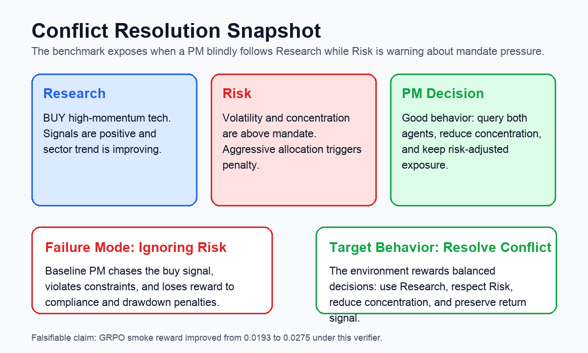
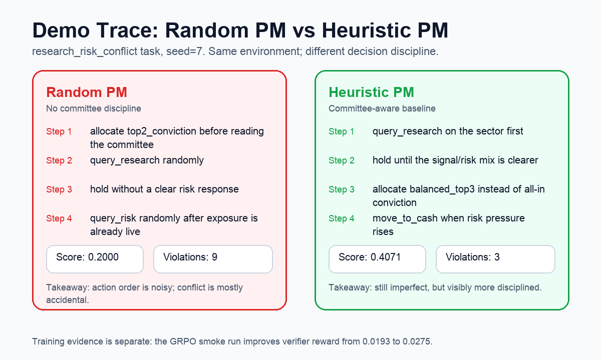
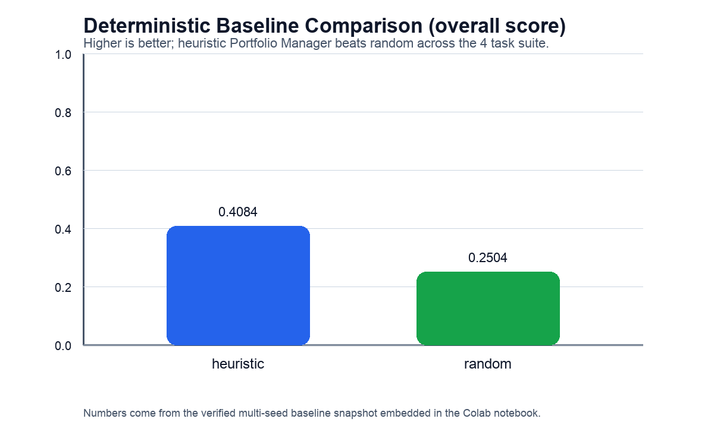
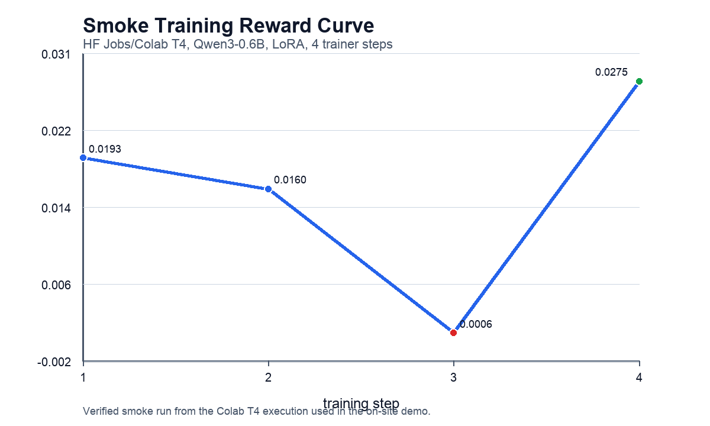
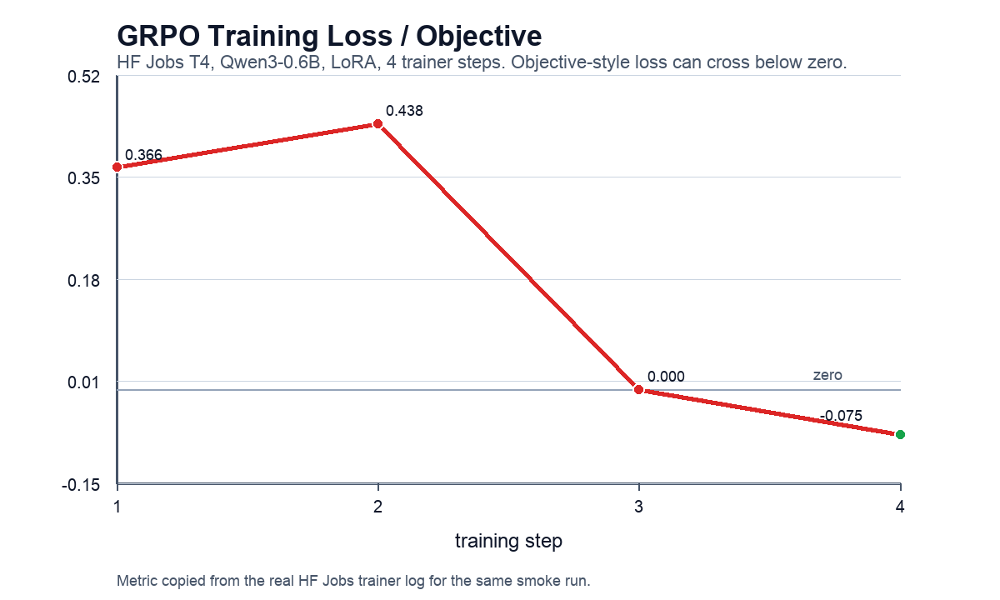

# AI Investment Committee Environment

## A benchmark for conflict-aware LLM agents

LLMs can write confident investment opinions. That is not the hard part.

The hard part is what happens when professional roles disagree:

```text
Research: strong buy signal in high-momentum tech
Risk: volatility and concentration are above mandate pressure
Portfolio Manager: decide what to do now
```

This project turns that situation into a trainable OpenEnv environment. The goal is not to build a trading bot. The goal is to test whether an LLM agent can learn a more professional behavior: resolve conflict between opportunity and constraint.



## What the environment simulates

The environment has three committee roles:

- **Research Analyst:** emits useful but noisy market views.
- **Risk Officer:** flags concentration, drawdown, and mandate pressure.
- **Portfolio Manager:** the only trainable agent; chooses queries and portfolio actions.

The PM does not get a perfect world model. It sees partial observations, role-specific advice, portfolio state, and changing constraints. It must decide whether to query Research, query Risk, allocate, revise, hold, or move to cash.

This makes the environment a fit for three OpenEnv themes:

- **Multi-Agent Interactions:** the PM depends on other actors with different incentives.
- **World Modeling:** the PM must infer hidden market regimes from noisy signals.
- **Long-Horizon Planning:** bad decisions affect drawdown, turnover, and compliance later.

## The failure mode

The benchmark is built around one memorable failure:

```text
Bad PM:
  follows Research only
  increases concentration
  ignores Risk warnings
  triggers compliance and drawdown penalties

Target PM:
  asks both Research and Risk
  reduces concentration
  keeps some return exposure
  avoids mandate violations
```

That is the capability gap: not "can the model pick a stock?", but "can the model make a disciplined decision when two advisors disagree?"

The demo trace makes this concrete:



## Task ladder

The environment has four deterministic tasks:

| Task | What it tests |
| --- | --- |
| `guided_allocation` | basic committee workflow |
| `research_risk_conflict` | bullish Research versus tight Risk |
| `regime_shift_recovery` | hidden deterioration and recovery |
| `mandate_drift` | compliance rules tightening mid-episode |

Each task is scored from `0.0` to `1.0` using deterministic graders. The tasks are small enough to run quickly, but structured enough to expose whether the PM is using information and respecting constraints.

## Reward design

The reward is composable:

```text
reward
= portfolio_return
+ signal_alignment_bonus
+ information_usage_bonus
+ risk_response_bonus
- transaction_cost
- query_cost
- variance_penalty
- drawdown_penalty
- compliance_penalty
- invalid_action_penalty
```

This matters because a single return-only score is easy to game. A PM that goes all-in on Research can look good briefly but fail the committee task. A PM that always goes to cash avoids risk but fails to use opportunity. The reward is designed to favor balanced professional behavior.

## Baselines

Before training, we compare a random PM against a heuristic PM.

| Policy | Overall score | Return | Max drawdown | Information usage |
| --- | ---: | ---: | ---: | ---: |
| Random | `0.2504` | `-0.0061` | `0.0209` | `0.0436` |
| Heuristic | `0.4084` | `0.0217` | `0.0153` | `0.2716` |



The heuristic is not perfect. That is intentional. It gives the trainer a meaningful starting point without pretending the task is solved.

## Training evidence

We trained only the Portfolio Manager. Research and Risk stayed scripted so reward attribution remains clear.

Training setup:

- model: `Qwen/Qwen3-0.6B`
- trainer: Hugging Face `TRL` `GRPOTrainer`
- adapter: LoRA
- runtime: T4 GPU
- stable smoke config: `max_steps=4`, `repeats_per_task=2`

Verified smoke result:

| Metric | Value |
| --- | ---: |
| Reward start | `0.0193` |
| Reward end | `0.0275` |
| Reward delta | `+0.0082` |
| Best step | `4` |



The run also logged the GRPO optimizer loss/objective. GRPO loss can cross below zero because it is not a standard supervised accuracy loss.



We also ran an 8-step comparison. It peaked at step `4` and then regressed, which is why the final demo uses the 4-step smoke configuration. That regression is useful evidence rather than a failure: it shows the environment is sensitive enough to expose unstable optimization.

## What this proves

This does not prove we have a production-quality financial agent. That is not the claim.

The claim is narrower and testable:

> AI Investment Committee Environment is a working OpenEnv benchmark where verifier-driven RL can produce measurable training signals for conflict-aware decision-making.

The project demonstrates:

- a non-toy professional environment
- explicit multi-agent roles
- deterministic tasks and graders
- a reward model that captures more than return
- a runnable TRL training surface
- real reward and loss plots from a GPU run

## Links

- Hugging Face Space: [anupamagarwal001/amc_allocator_env](https://huggingface.co/spaces/anupamagarwal001/amc_allocator_env)
- Live app: [anupamagarwal001-amc-allocator-env.hf.space/web](https://anupamagarwal001-amc-allocator-env.hf.space/web)
- GitHub repository: [anupamagarwal001/hackathon_submission](https://github.com/anupamagarwal001/hackathon_submission)
- Colab notebook: [Google Colab runbook](https://colab.research.google.com/drive/1Rj7rkkYTxhoqCqmpbR5b48dOeNP5Oucw)
- HF Jobs artifacts: [hf-job-20260425-070718](https://huggingface.co/datasets/anupamagarwal001/amc-allocator-job-artifacts/tree/main/hf-job-20260425-070718)
