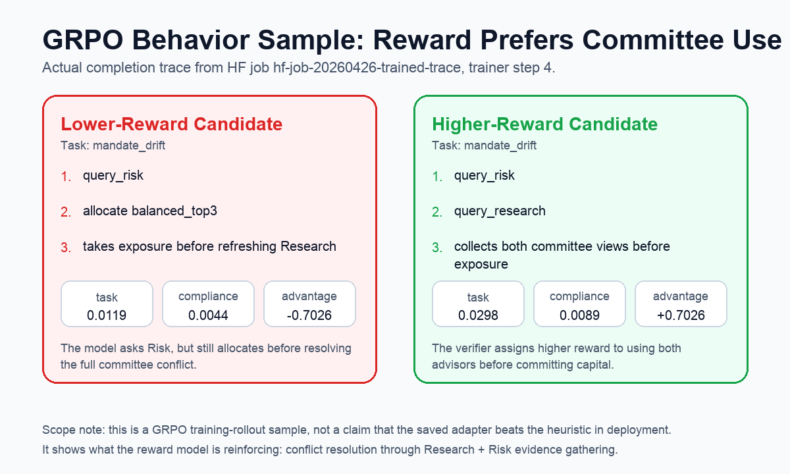

# AI Investment Committee Environment

**Can an LLM learn to behave like a real investment committee member when Research and Risk disagree?**

This project is a multi-agent OpenEnv benchmark for conflict-aware decision-making. A trainable **Portfolio Manager** must manage a portfolio while interacting with two scripted environment actors:

- **Research Analyst:** finds opportunities and emits noisy buy/sell conviction.
- **Risk Officer:** enforces mandate pressure, concentration limits, and drawdown discipline.
- **Portfolio Manager:** decides when to query, allocate, revise, hold, or move to cash.

The failure mode is intentionally human: a naive PM chases Research and ignores Risk. The target behavior is not maximum return at all costs; it is professional judgment under conflicting incentives.

## Submission Links

| Deliverable | Link |
| --- | --- |
| Hugging Face Space | [anupamagarwal001/amc_allocator_env](https://huggingface.co/spaces/anupamagarwal001/amc_allocator_env) |
| Live app | [anupamagarwal001-amc-allocator-env.hf.space/web](https://anupamagarwal001-amc-allocator-env.hf.space/web) |
| Public code repository | [anupamagarwal001/hackathon_submission](https://github.com/anupamagarwal001/hackathon_submission) |
| Colab training notebook | [Google Colab runbook](https://colab.research.google.com/drive/1Rj7rkkYTxhoqCqmpbR5b48dOeNP5Oucw) |
| HF mini-blog | [Blog.MD](https://huggingface.co/spaces/anupamagarwal001/amc_allocator_env/blob/main/Blog.MD) |
| Primary HF Jobs artifacts | [hf-job-20260425-070718](https://huggingface.co/datasets/anupamagarwal001/amc-allocator-job-artifacts/tree/main/hf-job-20260425-070718) |
| 8-step comparison artifacts | [hf-job-20260425-8step](https://huggingface.co/datasets/anupamagarwal001/amc-allocator-job-artifacts/tree/main/hf-job-20260425-8step) |
| Trained trace artifacts | [hf-job-20260426-trained-trace](https://huggingface.co/datasets/anupamagarwal001/amc-allocator-job-artifacts/tree/main/hf-job-20260426-trained-trace) |

## Try The Live Environment

The Space exposes both a visual OpenEnv playground and the raw API:

1. Open the live app at [`/web`](https://anupamagarwal001-amc-allocator-env.hf.space/web), then click **Reset**.
2. Try one action in the form, for example `action_type=query_research`, `query_target=SECTOR`, then click **Step**.
3. If the playground is unavailable, use the Swagger fallback at [`/docs`](https://anupamagarwal001-amc-allocator-env.hf.space/docs): call `POST /reset`, then `POST /step`.

Sample `POST /step` body:

```json
{
  "action": {
    "action_type": "query_research",
    "query_target": "SECTOR",
    "reason": "Demo: get the committee research view before allocating."
  }
}
```

## The One-Screen Story

The benchmark exposes when a Portfolio Manager blindly follows Research while Risk is warning that the mandate is under pressure.


**Falsifiable claim:** this environment measures whether verifier-driven RL can improve conflict-aware PM behavior. In a verified HF Jobs/Colab smoke run, reward improved from `0.0193` to `0.0275` over the stable 4-step config.

## What The Agent Does In A Run

The clearest visible behavior difference is between a random PM and a committee-aware heuristic PM on the same conflict task.


This is baseline behavior, not a claim that the trained policy beats the heuristic. The trained evidence is the GRPO reward signal shown below.

## What Changed After Training?

This is a small smoke run, not a claim of convergence. The important point is that the full loop exists and produces measurable signals:

- OpenEnv environment with `reset`, `step`, and `state`
- verifier-style reward components
- TRL `GRPOTrainer`
- LoRA adapters on `Qwen/Qwen3-0.6B`
- exported reward/loss curves and judge-facing reports
- exported LoRA adapter and GRPO completion traces

| Evidence | Result |
| --- | ---: |
| Heuristic PM overall score | `0.4084` |
| Random PM overall score | `0.2504` |
| Score delta vs random | `+0.1580` |
| Smoke-run reward start | `0.0193` |
| Smoke-run reward end | `0.0275` |
| Smoke-run reward delta | `+0.0082` |
| Stable best step | `4` |


The trained trace run also preserves the actual GRPO completion files and LoRA adapter. A late training sample shows the verifier assigning higher reward to a candidate that gathers both Risk and Research before taking exposure.



This is intentionally scoped as training-rollout evidence. It shows what the reward model is reinforcing; it is not a claim that the saved adapter already beats the heuristic baseline in deployment.


The 8-step comparison is also included because it is useful evidence: the run peaked at step `4` and regressed after that. That is why the final demo uses the 4-step config instead of pretending that longer training was automatically better.

## Inference And Evaluation Results

The repository keeps inference separate from training. [`inference.py`](./inference.py) runs a policy through the OpenEnv tasks and prints structured `[START]`, `[STEP]`, and `[END]` blocks with per-task scores. That is the judge-facing "agent acts in the environment" path.

Current verified inference/evaluation result:

```text
guided_allocation        heuristic=0.3462
research_risk_conflict   heuristic=0.4071
regime_shift_recovery    heuristic=0.4211
mandate_drift            heuristic=0.4591
overall heuristic score  0.4084
overall random score     0.2504
```

## Why This Is Not A Toy Finance Simulator

The environment is about **conflict resolution**, not stock picking. The PM sees partial state, noisy role-specific advice, changing constraints, and delayed portfolio consequences. It must decide when to trust Research, when to respect Risk, and when to revise a previous decision.

That maps directly to the Round 2 themes:

- **Multi-Agent Interactions:** Research, Risk, and PM have different objectives.
- **World Modeling:** the PM never sees hidden market regimes directly.
- **Long-Horizon Planning:** drawdown, turnover, and mandate drift compound over time.
- **Self-Improving Systems:** the PM is the trainable role; the other actors make the environment stable and measurable.

## Environment Design

The task ladder has four deterministic scenarios:

| Task | What It Tests |
| --- | --- |
| `guided_allocation` | basic committee workflow and sensible allocation |
| `research_risk_conflict` | bullish Research versus tight Risk constraints |
| `regime_shift_recovery` | hidden deterioration followed by selective re-risking |
| `mandate_drift` | compliance rules tighten mid-episode |

The PM action space is deliberately workflow-shaped:

- `query_research`
- `query_risk`
- `allocate`
- `revise_allocation`
- `hold`
- `move_to_cash`

The observation includes prices, signals, constraints, recent committee notes, portfolio state, reward breakdowns, risk metrics, and remaining query budget.

## Reward Model

The reward is composable rather than a single vague score:

```text
reward
= portfolio_return
+ signal_alignment_bonus
+ information_usage_bonus
+ risk_response_bonus
- transaction_cost
- query_cost
- variance_penalty
- drawdown_penalty
- compliance_penalty
- invalid_action_penalty
```

This makes the verifier harder to game. A PM cannot win by always going to cash, blindly maximizing return, or spamming queries. The score only improves when the agent balances return, information usage, risk response, and mandate discipline.

## Training Surface

The training setup intentionally trains only one role:

- trainable: **Portfolio Manager**
- scripted environment actors: **Research Analyst** and **Risk Officer**

This keeps reward attribution clean. If behavior improves, the change came from the PM policy rather than from moving all agents at once.

Core training files:

- [`training/committee_grpo_colab.ipynb`](./training/committee_grpo_colab.ipynb)
- [`training/committee_grpo_train.py`](./training/committee_grpo_train.py)
- [`training/committee_eval.py`](./training/committee_eval.py)
- [`training/committee_artifacts.py`](./training/committee_artifacts.py)
- [`training/hf_jobs_smoke.py`](./training/hf_jobs_smoke.py)
- [`training/launch_hf_job.py`](./training/launch_hf_job.py)

Judge-facing runbooks:

- [`Blog.MD`](./Blog.MD)
- [`docs/ROUND2_DEMO_FLOW.md`](./docs/ROUND2_DEMO_FLOW.md)
- [`docs/ROUND2_TRAINING_RUNBOOK.md`](./docs/ROUND2_TRAINING_RUNBOOK.md)
- [`docs/ROUND2_PITCH_SCRIPT.md`](./docs/ROUND2_PITCH_SCRIPT.md)
- [`docs/ROUND2_ONSITE_CHECKLIST.md`](./docs/ROUND2_ONSITE_CHECKLIST.md)
- [`docs/AI_Investment_Committee_Deck.html`](./docs/AI_Investment_Committee_Deck.html)

## Reproduce The Key Checks

Use Python 3.11.

```bash
uv sync --python python3.11 --extra dev
```

Run the validator-compatible inference entrypoint:

```bash
python3.11 inference.py --policy heuristic
python3.11 inference.py --policy random
```

Run baseline evaluation:

```bash
python3.11 training/committee_eval.py --policy heuristic
python3.11 training/committee_eval.py --policy random
```

Regenerate the committed README plots:

```bash
python3 training/generate_readme_assets.py
```

Launch the HF Jobs smoke run:

```bash
python3 training/launch_hf_job.py launch
```

Validate the OpenEnv server locally:

```bash
AMC_TASK_ID=guided_allocation uvicorn server.app:app --host 0.0.0.0 --port 8000
openenv validate --url http://localhost:8000
```

## Project Layout

```text
amc_allocator_env/
├── Blog.MD
├── README.md
├── inference.py
├── models.py
├── tasks.py
├── graders.py
├── policies.py
├── data/
├── server/
├── training/
├── docs/
└── tests/
```

## What To Look At First

If you only have three minutes, open these in order:

1. [Conflict snapshot](./docs/assets/conflict_resolution_snapshot.png)
2. [Demo trace comparison](./docs/assets/demo_trace_comparison.png)
3. [GRPO behavior sample](./docs/assets/grpo_behavior_sample.png)
4. [Reward curve](./docs/assets/reward_curve.png)
5. [Loss curve](./docs/assets/loss_curve.png)
6. [HF mini-blog](./Blog.MD)
7. [Colab training notebook](https://colab.research.google.com/drive/1Rj7rkkYTxhoqCqmpbR5b48dOeNP5Oucw)
